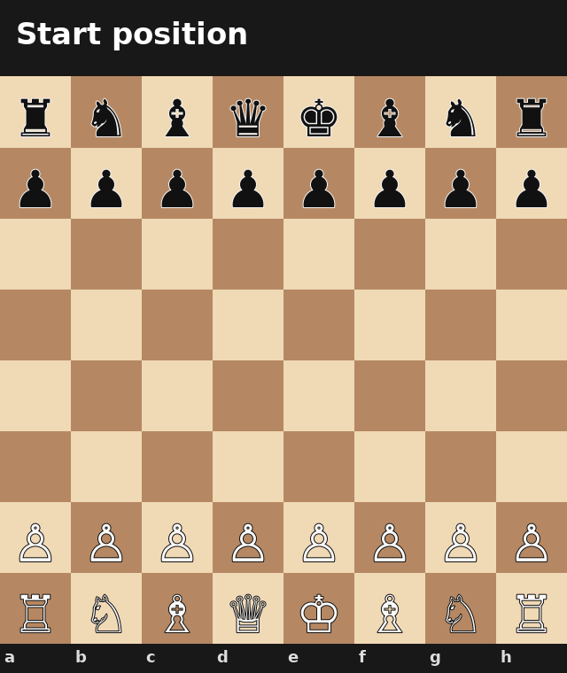

# making-fly-play-chess

No better way to use fly neurons than to make them play chess.

This project turns part of the fruit-fly connectome into a fixed neural reservoir for a chess position evaluator. A board position is encoded as numbers, activity propagates through fly-derived connections, and a learned readout scores the resulting position. White tries to raise the score; Black tries to lower it.

The connectome itself is not trained. Only the final readout weights learn from self-play.

This is a reservoir-computing experiment, not a biological simulation of a fly understanding chess. The optional 3D FlyGym view is also a visualization: chess readout activity is mapped onto simulated fly joints, but that mapping is not meant to reproduce real motor circuitry.



## play in Google Colab

| Standard interface | Interface with 3D FlyGym view |
| --- | --- |
| [](https://colab.research.google.com/github/mncrftfrcnm/making-fly-play-chess/blob/main/notebooks/fly_chess_inference.ipynb) | [](https://colab.research.google.com/github/mncrftfrcnm/making-fly-play-chess/blob/main/notebooks/fly_chess_inference_flygym.ipynb) |
| Faster. Chess board + neural activity view. | Slower. Adds MuJoCo/FlyGym simulation and video rendering after fly moves. |

For either notebook, open it in Colab and choose **Runtime → Run all**. The final cell launches the Gradio app.

The standard interface includes:

- **You vs Fly** and **Fly vs Fly** modes;
- White/Black side selection;
- a delay control and move limit for self-play;
- candidate move scores;
- the strongest reservoir activity and readout contributions;
- move history.

The FlyGym notebook keeps the same interface and adds **Show 3D fly**. It is off by default. Leaving it off skips physics simulation and video rendering, which makes games considerably faster.

## how it works

The board encoder produces 782 values:

- 64 squares × 12 piece/color channels;
- side to move;
- castling rights;
- en passant file;
- half-move clock.

Those values drive the first 782 units of an 8,192-neuron reservoir selected from the connectome. Activity propagates through the fixed connection matrix for six steps. The model then reads 1,024 reservoir neurons and combines them with learned weights to produce a value between `-1` and `+1`.

For each legal move, the program makes the move on a copy of the board and evaluates the resulting position. White prefers higher values and Black prefers lower ones.

During training, the model learns only the readout weights. The fly-derived connectivity remains fixed.

### 3D fly view

The optional FlyGym version uses the same neural trace shown in the technical graph. For each propagation step, it takes the 1,024 chess readout neurons, applies the learned value weights, groups those contributions across FlyGym's actuated leg joints, and uses the result as small joint offsets.

There is no random neuron-to-body projection. The body movement is deterministic for a given neural trace, but the mapping is intentionally a visualization rather than a claim about biological motor function.

## run locally

The standard interface supports Python 3.10+.

```bash
git clone https://github.com/mncrftfrcnm/making-fly-play-chess.git
cd making-fly-play-chess
python -m venv .venv
```

Activate the environment:

```bash
# macOS / Linux
source .venv/bin/activate

# Windows PowerShell
.venv\Scripts\Activate.ps1
```

Install and run the standard interface:

```bash
python -m pip install --upgrade pip
python -m pip install -r requirements.txt
python scripts/fly_chess_inference.py
```

### run with FlyGym

FlyGym 2.1 requires Python 3.12–3.14. Use a Python 3.12+ environment and install the optional requirements:

```bash
python -m pip install -r requirements-flygym.txt
python scripts/fly_chess_inference_flygym.py
```

The **Show 3D fly** option is off by default. Turn it on only when you want the simulated body view.

## train it yourself

Training needs the source connectome files:

```bash
python -m pip install -r requirements-train.txt
git clone --depth 1 https://github.com/philshiu/Drosophila_brain_model.git Drosophila_brain_model
python scripts/fly_chess_trainer.py
```

The default configuration uses 3,000 self-play games and 8,192 reservoir neurons. For a quick pipeline test, lower `SELF_PLAY_GAMES` near the top of `scripts/fly_chess_trainer.py`.

| Setting | Default | Meaning |
| --- | ---: | --- |
| `SELF_PLAY_GAMES` | `3000` | self-play games |
| `RESERVOIR_NEURONS` | `8192` | reservoir size |
| `READOUT_NEURONS` | `1024` | neurons used by the value readout |
| `PROPAGATION_STEPS` | `6` | recurrent propagation steps |
| `MAX_PLIES` | `230` | maximum half-moves per training game |
| `LEARNING_RATE` | `0.002` | readout learning rate |

If `fly_chess_model.joblib` already exists, training continues from its saved readout weights and writes the updated model back to the same file.

A Colab training notebook is available at [`notebooks/fly_chess_trainer.ipynb`](notebooks/fly_chess_trainer.ipynb).

## repository layout

```text
making-fly-play-chess/
├── .github/workflows/pylint.yml
├── notebooks/
│   ├── connectome_vs_classical_architectures.ipynb
│   ├── fly_chess_inference.ipynb
│   ├── fly_chess_inference_flygym.ipynb
│   └── fly_chess_trainer.ipynb
├── scripts/
│   ├── fly_chess_inference.py
│   ├── fly_chess_inference_flygym.py
│   ├── fly_chess_trainer.py
│   └── gif_gen.py
├── fly_chess_model.joblib
├── chess_selfplay.gif
├── requirements.txt
├── requirements-flygym.txt
├── requirements-train.txt
├── LICENSE
└── README.md
```

The connectome-vs-classical comparison notebook is also kept at the repository root so the experiment is easy to find.

## how good is it?

This is an experiment first and a chess engine second. I have not established a reliable Elo rating, and the current model was trained on only a few thousand self-play games. Treat the included game and comparison notebook as demonstrations, not as a competitive benchmark.

## does the connectome help?

The current comparison does not show a clear advantage from using the connectome over simpler fixed architectures. That result is still useful: the point of the project is to test what happens when a real connectome-derived topology is repurposed as a reservoir, not to claim that a fly brain is naturally good at chess.

The comparison experiment is [`connectome_vs_classical_architectures.ipynb`](connectome_vs_classical_architectures.ipynb), with an identical copy under [`notebooks/`](notebooks/connectome_vs_classical_architectures.ipynb).

## credit

Connectome data comes from [philshiu/Drosophila_brain_model](https://github.com/philshiu/Drosophila_brain_model), accompanying the paper [*A leaky integrate-and-fire computational model based on the connectome of the entire adult Drosophila brain reveals insights into sensorimotor processing*](https://doi.org/10.1101/2023.05.02.539144).

The optional body simulation uses [FlyGym / NeuroMechFly](https://neuromechfly.org/).

This repository is licensed under the [Apache License 2.0](LICENSE).
